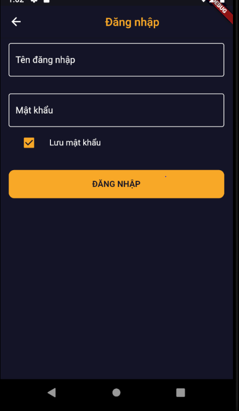
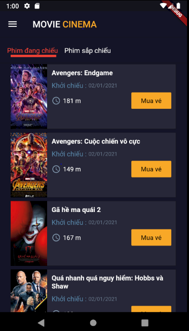
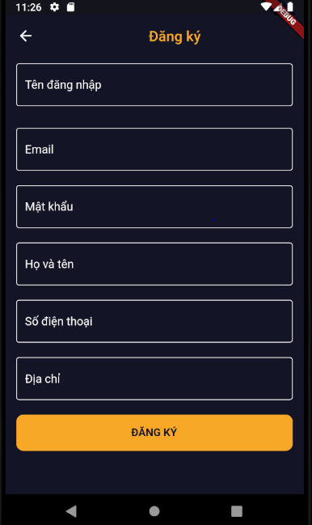

# Ứng dụng MOVIE CINEMA

Ứng dụng giúp cho người dùng có thể đặt lịch chiếu phim giúp cho các rạp phim bán các vé phim của mình qua ứng dụng di động

## Nội dung :

1. [Chức năng](#chức-năng)

   1. [Đăng nhập](#đăng-nhập)/[Đăng Ký](#đăng-ký)

   1. [Xem Danh sách phim](#Xem-danh-sách-phim)
   
   1. [Xem chi tiết phim](#xem-chi-tiết-phim)

   1. [Chọn lịch chiếu phim](#Chọn-lịch-chiếu-phim)
   
   1. [Chọn hàng ghế mình mong muốn và số lượng ghế](#Chọn-hàng-ghế-mình-mong-muốn-và-số-lượng-ghế)

   1. [Mua các món ăn đi kèm](#Mua-các-món-ăn-đi-kèm)

   1. [Xác nhận thông tin](#Xác-nhận-thông-tin)

   1. [Đặt mua vé](#Đặt-mua-vé)

   1. [Xem thông tin vé đã mua](#Xem-thông-tin-vé-đã-mua)
   
1. [Yêu cầu thiết bị](#yêu-cầu-thiết-bị)

1. [Thư viện và công nghệ](#thư-viện-và-công-nghệ)

1. [Tác giả](#tác-giả)

1. [Giấy phép](#giấy-phép)

## Chức năng
### Đăng nhập
   * Đăng nhập
   
   

    
   

   
   ### Xem Danh sách phim
   * Thông tin phim đang chiếu và thông tin phim sắp chiếu
     
   

    
   

### Xem chi tiết phim
   * Xem chi tiết thông tin phim
   
   

    
   

 

### Chọn lịch chiếu phim
   * Chọn lịch chiếu phim theo các rạp mình mong muốn
   
   

    
   

   
### Chọn hàng ghế mình và số lượng ghế
   * Chọn hàng ghế mình mong muốn và số lượng ghế theo nhu cầu của mình
   
   

    
   

      
### Mua các món ăn đi kèm
   * Chọn mua các sản phẩm đồ ăn đi kèm
   
   

    
   

         
### Xác nhận thông tin
   * Xác nhận thông tin đơn hàng của mình
   
   

    
   

   
### Đặt mua vé
   * Đặt mua vé
   
   

    
   

      
### Xem thông tin vé đã mua
   * Xem thông tin vé đã mua trong đó có mã QR code giúp cho việc nhận vé ở quầy lễ tân dễ dàng hơn
   
   

    
   

   
## Yêu cầu thiết bị
-Android:

   +Android studio : 3.0.1

   +Gradle : 4.1

   +Min sdk : 19

   +Target sdk : 26

-iOS:

   +iOS: 8.0
## Thư viện và công nghệ

- Language : Javascript

- FrameWork : Flutter 0.0.4

- Database: mongoDB

- Backend: Nodejs, express.js

* provider - https://pub.dev/packages/provider

* cupertino_icons - https://pub.dev/packages/cupertino_icons

* http - https://pub.dev/packages/http

* shared_preferences - https://pub.dev/packages/shared_preferences

## Tác giả
Nguyễn Ngọc Thanh Long - 17520714@gm.uit.edu.vn

Đoàn Anh Tú - 17521194@gm.uit.edu.vn

Đỗ Quang Thiện - 17521073@gm.uit.edu.vn
